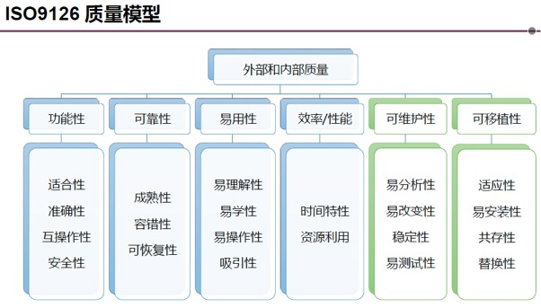
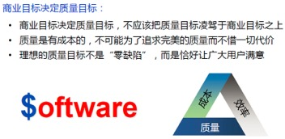
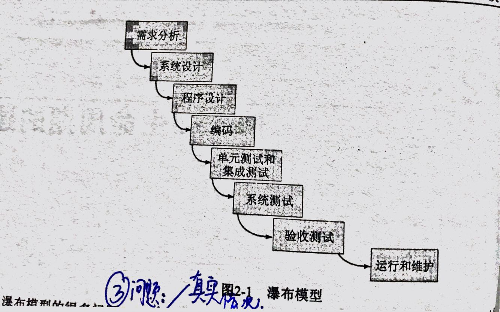
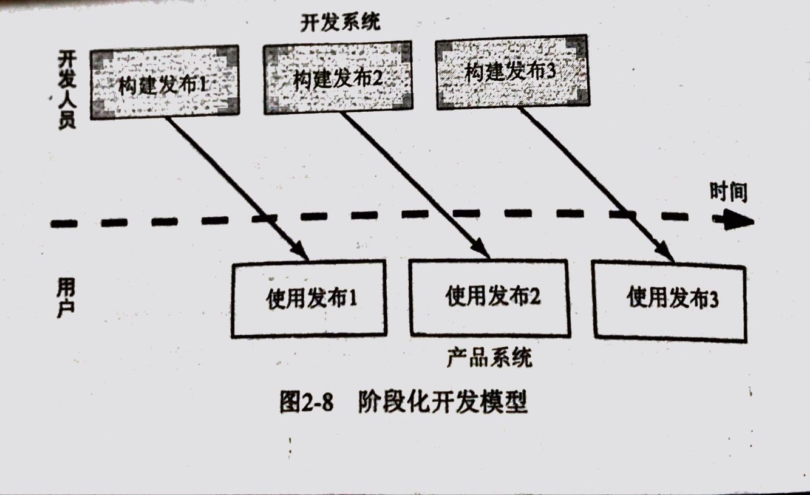

# 软件工程复习

# *part one 软件开发过程中涉及的活动*

## 第一章 软件工程概述

### 1.1 什么是软件工程

1.定义

- 定义：在将有关软件开发与应用的概念科学体系化的基础上，研究如何有计划、有效率、经济的开发和利用在计算机上能正确运行的理论和技术的工程方法学，一些开发和维护软件的方法、过程和原则。
- 方向：面向对象模式、结构化模式、基于过程的模式等。
- 作用：付出较低的开发成本，达到要求的软件功能，取得较好的软件性能，开发的软件易于移，需要较低的维护费用，能按时完成开发工作，及时交付使用。（是一个系统工程，既有对技术问题的分析和综合，也有对开发过程和参与者的管理）

2.问题求解过程

​    分析(将问题 分解 成若干小问题，子问题之间的关系) －> 构建解决方案 －>  合成

建造软件系统的工程化过程

   需求分析和定义、系统设计、程序设计、编程、单元测试、集成测试、系统测试、交付、维护

3.几个概念

​    技术(方法)：是产生某些过程的形式化结构，完成软件开发任务的技术手段

   工具：是用更好的方式完成某个事情的设备或自动化系统，为软件开发方法提供自动的或半自动的软件支撑环境

   过程：把工具和技术结合起来，共同生产特定产品（食谱），支持软件开发各个环节的控制和管理

   模式(范性)：表示构造软件的特定方法或哲学（烹饪风格，eg：面向对象开发vs面向过程开发），编程范型

4.软件工程师：使用工具、技术、过程、范性来提高软件产品的质量，管理软件的开发过程，他们的目标是使用高效的、高生产率的方法形成相关问题的有效解决方案

5.kp3:图1-3: se的地位作用

作用：设计和实现问题解决方案的工具和技术。

### 1.2软件工程取得的进展

1.描述bug的术语：

人为错误：在软件生产过程中的人为产生的错误（需求说明的错误、代码的错误）

缺陷(故障)：在软件开发活动的过程中出错(称为错误)，就会出现故障，内部存在但不一定表现出来。

​                                 单个错误可能产生多个故障。

失效：是指系统违背了它应有的行为，被发现的错误。

联系：缺陷是系统内部的观点，就像从开发者的角度看待问题那样；失败是外部观点，即从用户角度看到的问题，并非每一个缺陷都是失败。

2.kp4:图1-4：人为错误是如何引起的

### 1.3什么是好的软件

三种方式考虑质量：产品的质量、生产该产品过程的质量、在产品将使用的商业环境背景下产品的质量。

- 产品的质量：用户从外部特性看软件具有足够的功能并已于学习和使用就说明软件具有高质量，软件开发者从内部特征来看错误数量和类型来判断软件质量的高低。
- 过程的质量：有许多过程都能影响最终作品的质量，如果任何一个活动出现了差错，整个产品的质量就会受到影响。
- 商业的质量：即商业应用背景下的软件质量，讲技术价值与商业价值统一起来。

#### 1.3.1产品的质量

外部角度：用户角度，用户从故障数目和故障类型等外部特性进行评价。［Failures失效

内部角度：开发者角度，考虑产品的内部缺陷。［Fault缺陷

#### 1.3.2过程的质量

过程建模和过程改进

chap12、13会深入分析过程建模并改进框架

#### 1.3.3商业环境背景下的质量

### 1.4 软件工程涉及的人员

客户、用户、开发人员

- 客户：为将要开发的软件系统支付费用的公司、组织或个人

- 开发人员：为客户构建软件系统的公司、组织或个人，其中包括协调并指导程序员和测试人员的管理人员

- 用户：将实际使用系统的人，包括坐在终端前的人、提交数据的人或阅读输出的人

  关系：kp10 图1-7

### 1.5 系统的方法

边界：为项目（系统）提供的背景，规定什么在项目或系统里，什么不在

系统：对象和活动的集合，再加上对象和活动之间关系的描述【典型系统定义包括输入列表、采取的动作、产生的输出】

#### 1.5.1 系统的要素（se的组成）

1.活动和对象

活动：发生在系统的某些事情，由某个触发器引发的事件，活动通过改变某一特性将一个事物装换为另一个事物。

对象或实体：活动中涉及的要素。对象之间以某种方式彼此联系。

2.关系和系统边界

系统边界：某些项跨越边界进入系统 系统的产品也可以跨越边界被其他系统所使用。

定义系统：一组事物的集合：  

​    一组实体、一组活动、实体和活动之间的关系的描述、系统边界的定义

#### 1.5.2 相互联系的系统

一个系统可能存在于另一个系统内部

### 1.8软件工程过程中发生了多大的变化

一.改变软件工程实践的7个关键因素

1. 商业软件投放市场时间的紧迫性
2. 计算经济学的改变：硬件费用越来越低，而开发、维护费用越来越高
3. 功能强大的桌面计算机的出现
4. 局域网和广域网的延伸
5. 面向对象技术的出现及应用
6. 使用窗口、图标、菜单和指针的图形用户界面
7. 瀑布模型的不可知性

二.生产零缺陷软件(zero-defect software)的困难

软件具有 复杂性、一致性、可变性、不可见性 等固有特性，这是软件开发过程中的困难的根本原因

三.软件开发的基本策略：

四.se的wasserman规范

抽象

- 定义：基于某种层次归纳水平的问题描述。它使我们将注意力集中在问题的关键方面而非细节。

分析方法和设计方法以及符号

用户界面原型化

软件体系结构

软件过程

- 定义：软件开发活动中产生某种期望结果的一系列有序任务，涉及活动、约束和资源。
- 重要性：通用性：在一组活动上保持一致性和结构性。一致性和结构性可以使我们知道是否已经做好了工作，还能是别人以同样的方式做工作，因而具有相对通用性。指导性：分析、检查、理解、控制、改善活动

- a.需求文档：主要包括项目计划、可行性研究报告、软件需求规格说明书（SRS）
- b.系统设计：主要包括系统设计文档和软件结构图。
- c.程序设计：包括模块功能算法和数据描述文档
- d.程序实现：主要是源程序和注释。
- e.单元测试：由模块测试和性能测试产生的测试报告
- f.集成测试：按照结构图进行测试产生的测试报告
- g.系统测试：按着软件需求规格说明书（SRS）对系统总体功能进行测试产生的测试报告。
- h.系统提交：交付产品，用户手册或操作手册。
- i.系统维护：修改软件的过程，为满足改错或新需求产生的维护报告

复用

- 定义：重复采用以前开发的软件系统中具有共性的部件，用到新的开发项目中去。（这里的重用不仅仅是源代码的重用）

测度

工具和集成环境

## 第二章 过程和生命周期的建模

### 2.1过程的含义 (process)

1.定义：将一组有序的任务称为过程：它涉及活动、约束和资源使用的一系列步骤，用于产生某种想要的输出。

2.过程特征：

- 过程规定了**所有**主要的过程**活动**
- 过程遵从一组**约束**使用**资源**，并产生中间结果和最终产品
- 过程可以是用某种方式链接起来的**子过程**构成
- 每个过程活动具有进入和退出标准，这样可以知道**活动的开始和结束**时间
- 活动可以按照一定的顺序加入组织
- 每一个活动都有其指导原则，用于解释每个**活动的目标**
- **约束和控制**可以应用于活动、资源或产品

3.设计产品构建的过程称为生命周期。

软件开发过程描述了软件产品从概念到实现、交付、使用和维护的整个过程称为软件生命周期。

4.过程建模的意义

- 使活动保持一致性和结构化
- 过程结构允许我们分析、理解、控制和改进组成过程的活动，并以此指导我们的活动
- 获取经验

### 2.2软件过程模型

1.原因

- 对软件开发的共同理解
- 发现不一致和冗余
- 明确开发目标
- 根据需要裁剪

#### 2.2.1 瀑布模型

1.定义：

开发阶段严格按照线性方式进行，每一个阶段具有相关的里程碑和交付产品，且需要确认和验证。

2.特征

- 阶段间的线性关系
- 以交付物作为活动结束的里程碑【每个阶段都有一个里程碑】

3.存在问题

- 无法反应真实情况
- 无法处理变化
- 制造业模式
- 无迭代活动
- 交付周期过长

4.原型 是一个部分开发的产品【demo】

#### 2.2.2 V模型

1.定义：v模型是瀑布模型的变种，编码处于V型符号顶点，分析和设计在左边，测试和维护在右边。

2.特征：

（1）强调测试活动与分析设计活动的关联

（2）问题发现

#### 2.2.3原型化模型

1.定义：他是瀑布模型的改进，但是原型化模型不仅仅附属于瀑布模型。

2.特点：

（1）允许开发人员快速构造整个系统或者系统的一部分

（2）总体目标保持不变，减少了开发中的风险和不确定性

#### 2.2.6阶段化开发：增量和迭代

1.循环周期：从编写需求文档到系统交付使用

2.阶段化的开发模型

3.特点：版本发布与开发并行，缩短开发周期，分批交付

4.增量开发：定义发布时先定义一个小的功能子系统，然后在每个新的发布中增加新功能。

   迭代开发：在一开始就提交一个完整的系统，然后在每一个新的发布中，改变每个子系统的功能。

#### 2.2.7螺旋模型

特点：

（1）引入风险管理活动，以降低风险和控制风险

（2）迭代产物

- 第一次迭代：操作原型
- 第二次迭代：需求
- 三：设计
- 四：测试

#### 2.2.8敏捷开发

1.思想：

以人为核心、迭代、循序渐进。在敏捷开发中，软件项目的构建被切分成多个子项目，各个子项目的成果都经过测试具备集成和可运行的特征。in a word，就是把一个大项目切分成多个相互联系但是又可以独立运行的小项目，并分别完成，在此过程中软件一直处于可使用状态。

2.原则：

（1）重视个体和交流

（2）重视可运行的软件

（3）注重与客户的协作

（4）应变能力

3.目标：

（1）尽快的、持续的交付发布有价值的软件

（2）在过程中增加灵活性，以允许后期客户要求的变化

4.Scrum（并列争球法）特征：

（1）核心：迭代、增量的过程

（2）角色：没有对软件实践做出具体的处方，注重self-orgnization

（3）需求在一次迭代中不允许变化

5.xp（极限编程）：

特征：交流、简单、勇气、反馈

提倡测试先行 允许需求变化

## 第三章 计划和管理项目

### 3.1跟踪项目进展（项目进度）

1.项目进度：通过列举项目的各个阶段，把每个阶段分解成离散的任务或活动，来描述特定项目的软件开发周期。

2.活动：项目的一部分，在一段时间内发生。

3.里程碑：活动的完成

进度管理部分

项目进程 Project schedule

活动和里程碑 Milestones and activities

工作分解结构 Work breakdown structure (WBS)

活动及其属性 Activity (precursor,duration,due date, endpoint) 

活动图 Activity graph

空闲时间 Slack time = available time - real time = latest start time - earliest start time

关键路径 Critical path

关键路径方法 Critical path method (CPM)

2. 人员管理部分
   关键活动 Key activities requiring personnel
   人员特征 Choosing personnel
   工作方式 Work styles
   选择合适的组织 Choosing project organization

   3. 成本估算部分
      专家判断方法的特征、问题
      算法模型 E = (a + bSc) m(X)
      COCOMO II 模型
   4. 风险管理部分
      风险影响 Risk impact
      风险概率 Risk probability
      风险控制 Risk control
      风险成本 Risk exposure = (risk probability) x (risk impact)

   风险管理活动 Risk management activities (Figure 3.15)
   风险降低的3种策略

   5. 项目计划
      （简单了解）

# *part two 软件开发过程的主要步骤*

